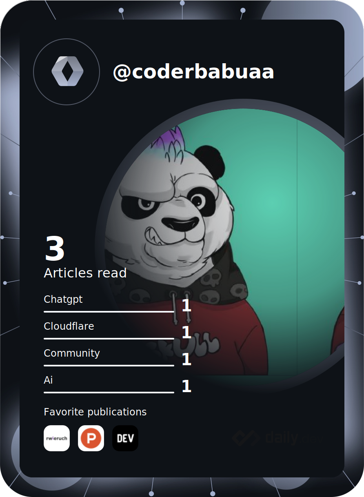

<h1> Hello Fellow < Developers/ >!       

 
</h1>

I'm Manish Tiwari, a Full-Stack Web Developer from India  
. Besides doing Web-Dev I love playing Drums and making Hip-Hop style beats and remixes on DAW's. Checkout my repositories to follow my development journey 

<h2> About Me :question:</h2>

- 🌱 I'm currently learning Data Structures and Algorithms
- 👯 I'm looking to collaborate on Innovative Realtime Projects
- 💬 Talk to me about Web Development, Hackathons and Content Creation

<h2> Skills   </h2>

 
                      

<h2> Connect with me  </h2>

 &nbsp  
  &nbsp 
   &nbsp
  &nbsp
   &nbsp
 &nbsp
 &nbsp
   

<h2 align="center">Github Trophies:trophy:</h2>

  

<h2>GitHub Stats</h2>

  

    
    
  

 <h2>Leetcode Stats  </h2> 
 

  

