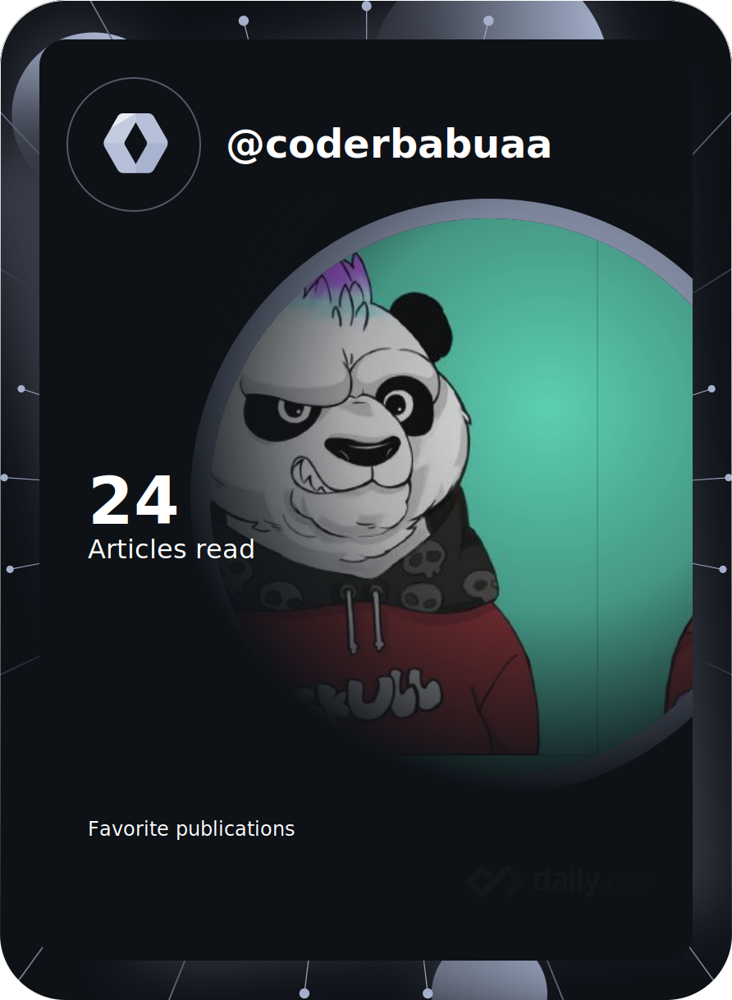

<h1> Hello Fellow < Developers/ >!       

 
</h1>

Hello, I'm a Software Engineer from India   I Enjoy building impactful products!

<h2> About Me :question:</h2>
<!--  -->

<h2> Skills :man_technologist:</h2>

  

<!-- 
<h2> Connect with me :love_you_gesture:</h2>

 &nbsp  
  &nbsp 
   &nbsp
  &nbsp
   &nbsp
 &nbsp
 &nbsp
   

 -->

<h2 align="center">Github Trophies :trophy:</h2>

  

<h2>GitHub Stats⚡</h2>

  

    
    
  

<!-- 

 <h2>Leetcode Stats⚡</h2> 
 

  

 -->

